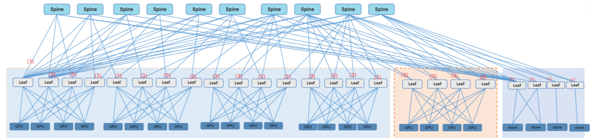

# Overview of Cluster_2000_A100 Traces

The released trace contains both training logs and cluster traffic traces with LLMs training tasks.
It is collected from a production cluster with 2024 Nvidia A100 GPUs (on 253 servers) during May of 2024.

# Cluster Architecture

The architecture of this cluster is illustrated as follows:
<!-- todo -->

The cluster leverages a two-layer Leaf-Spine architecture to provide the 200Gbps no-congestion lossless network.
The network contains 20 leaf switches downlinking the 253 servers, 10 spine switches and 4 switches connecting the storage servers.


# Introduction of Trace Data

The traces include three parts of data as follows:
- `cluster_2000_A100.xlsx`: this file contains information about the topology and linking relationships of this culster, specifically focusing on the network connections and configurations related to servers and GPUs. The dataset is organized into two sheets: "cluster topology" and "GPU NIC info," each containing relevant details about network ports, IP addresses, switches, and network interface cards (NICs).
- `trafficinfo`
- `taskinfo`

## Cluster Architecture: `cluster_2000_A100.xlsx`

### Overview

This file contains information about the topology and linking relationships of this culster, specifically focusing on the network connections and configurations related to servers and GPUs. The dataset is organized into two sheets: "cluster topology" and "GPU NIC info," each containing relevant details about network ports, IP addresses, switches, and network interface cards (NICs).

#### Sheet: `cluster topology`
A row of data in this sheet represents the connection of a specific NIC on the server to the leaf switch.

| Field        | Description                                                                 | Example|
|--------------|-----------------------------------------------------------------------------|--------|
| accessport   | Specifies the port used for one Leaf switch to connecting a server. | `TwoHundredGigE1/0/1:2`|
| nicname      | The name of a network interface card (NIC) on the server.                 |`ens11np0`|
| switchIP     | The IP address of the switch.                                               |`10.107.208.111`|
| switchname   | The name of the switch.                                                     |`Leaf-1`|
| serverIP     | The IP address of the server.                                               |`10.107.222.1`|

Take the `Example ` in the table as an example, which means the NIC named `ens11np0` in server `GPU-1` is connected to the `TwoHundredGigE1/0/1:2` port of `Leaf-1` switch.

#### Sheet: `server NIC info` 

This sheet provides information about the network interface cards (NICs) associated with GPUs, including the GPU IP address and the primary and secondary NIC names.

| Field        | Description                                                                 | Example|
|--------------|-----------------------------------------------------------------------------|--------|
| server IP    | The IP address of the server.   |`10.107.254.1`|
| NIC name 1   | the NIC name in the training log|`mlx5_2`|
| NIC name 2   | the NIC name in the traffic data|`ens10np0`|

## traffic info: `trafficinfo`

This folder contains information about traffic in the cluster network, and each subfolder contains one hour of network data.
Take folder `2024052400` as an example, this folder contains network data from 00:00 to 01:00 on May 24, 2024,its file tree is:
```shell
tree -L 2
.
└── 2024052400
    ├── 2024052400.xlsx
    ├── NH-DC-NM129-B03-ROCE-Leaf-1_GPU_S9825
    ├── NH-DC-NM129-B04-ROCE-Leaf-2_GPU_S9825
    ├── NH-DC-NM129-B05-ROCE-Leaf-3_GPU_S9825
    ├── NH-DC-NM129-B06-ROCE-Leaf-4_GPU_S9825
    ├── NH-DC-NM129-D03-ROCE-Leaf-5_GPU_S9825
    ├── NH-DC-NM129-D04-ROCE-Leaf-6_GPU_S9825
    ├── NH-DC-NM129-D05-ROCE-Leaf-7_GPU_S9825
    ├── NH-DC-NM129-D06-ROCE-Leaf-8_GPU_S9825
    ├── NH-DC-NM129-F02-ROCE-Leaf-9_GPU_S9825
    ├── NH-DC-NM129-F03-ROCE-Leaf-10_GPU_S9825
    ├── NH-DC-NM129-F04-ROCE-Leaf-11_GPU_S9825
    ├── NH-DC-NM129-F05-ROCE-Leaf-12_GPU_S9825
    ├── NH-DC-NM129-H03-ROCE-Leaf-13_GPU_S9825
    ├── NH-DC-NM129-H04-ROCE-Leaf-14_GPU_S9825
    ├── NH-DC-NM129-H05-ROCE-Leaf-15_GPU_S9825
    ├── NH-DC-NM129-H06-ROCE-Leaf-16_GPU_S9825
    ├── NH-DC-NM129-J01-ROCE-Leaf-17_GPU_S9825
    ├── NH-DC-NM129-J02-ROCE-Leaf-18_GPU_S9825
    ├── NH-DC-NM129-J03-ROCE-Leaf-19_GPU_S9825
    ├── NH-DC-NM129-J04-ROCE-Leaf-20_GPU_S9825
    ├── NH-DC-NM224-J05-ROCE-ST-leaf-1_GPU_S9825
    ├── NH-DC-NM224-J06-ROCE-ST-leaf-2_GPU_S9825
    ├── NH-DC-NM224-J07-ROCE-ST-leaf-3_GPU_S9825
    └── NH-DC-NM224-J08-ROCE-ST-leaf-4_GPU_S9825
```
The contents of the folder can be divided into two parts. The first part, i.e. `2024052400_flow|nic|link|port.csv` contain information about all links and QPs in the cluster network, while the second part consists of 24 subfolders, e.g. `NH-DC-NM129-B03-ROCE-Leaf-1_GPU_S9825`, each corresponding to real-time traffic information for all ports of a switch.

Next, the network data information will be introduced using folder `2024052400` as an example.
### Link and Queue Pair information in the network: 
This part contains four csv files:
- file `2024052400_flow.csv`  records data flow details between servers, including source and destination servers, switches, IP addresses, queue pairs, and various packet counts.
- file `2024052400_nic.csv` scaptures NIC metrics, such as bytes and packets received and transmitted, along with error counts and operational statuses.
- file `2024052400_link.csv`  details all links' information, including device names, port names, packet counts, speeds, and usage ratios.
- file `2024052400_port.csv`  provides all ports' statistics, focusing on bytes, speed, usage ratios, and packet losses. Each sheet contains timestamped records to track network performance and issues comprehensively.

### `2024052400_flow`

| Column       | Description                                      | Example Value                  |
|--------------|--------------------------------------------------|--------------------------------|
| SourceServer | The server from which data originates            | `NH-DC-NM129-I04-20U-GPU-239`    |
| DestServer   | The server to which data is sent                 | `NH-DC-NM129-H10-28U-GPU-226`    |
| SourceSwitch | The Leaf switch connected to the source server        | `NH-DC-NM129-H04-ROCE-Leaf-14.GPU.S9825` |
| DestSwitch   | The Leaf switch connected to the destination server   | `NH-DC-NM129-H04-ROCE-Leaf-14.GPU.S9825` |
| Time         | The time at which the current data is recorded               | `2024/5/24 上午12:00:00`          |
| SourceIp     | The IP address of the source server              | `10.107.235.59`                  |
| DestIp       | The IP address of the destination server         | `10.107.235.46`                  |
| SourceQp     | Source queue pair                                | `15952        `                  |
| DestQp       | Destination queue pair                           | `9662         `                  |
| Rtt          | Round-trip time (ns)                                  | `5887         `                  |
| ReadPkts     | Number of read packets                           | `0            `                  |
| WritePkts    | Number of write packets                          | `20           `                  |
| SendPkts     | Number of sent packets                           | `0            `                  |
| NakPkts      | Number of negative acknowledgment packets        | `0            `                  |

### `2024052400_nic`

| Column                        | Description                                      | Example|
|----------------------------   |--------------------------------------------------|--------------------------------|
| SaveTime                      | The timestamp when NIC metrics were saved            | `2024/5/24 上午00:00:04` |
| DeviceName                    | The name of the server| `NH-DC-NM129-A01-28U-GPU-1`   |
| Ip                            | The IP address of the device                     | `10.107.254.1`   |
| PortName                      | The name of the port                             | `mlx5_3`   |
| ReceivedBytes                 | Total bytes received                             | `1.826184052268872e+16`   |
| TransmittedBytes              | Total bytes transmitted                          | `1.825375677039005e+16`   |
| ReceivedPacketsByPort         | Packets received by this port                         | `496472930239.0`   |
| ReceiveddPacketsByUnicast     | Unicast packets received                         | `496472930239.0`   |
| TransmittedPacketsByPort      | Packets transmitted by this port                      | `390430116240.0`   |
| TransmitteddPacketsByUnicast  | Unicast packets transmitted                      | `390430116240.0`   |

### `2024052400_link`

| Column           | Description                                      | Example Value                  |
|------------------|--------------------------------------------------|--------------------------------|
| DeviceName       | The name of the device                           | `NH-DC-NM129-E09-ROCE-spine-9.GPU.S9825` |
| IfAbbreviatedName| Abbreviated port name                       | `400GE1/0/8`                     |
| DstDevice        | Destination device                               | `NH-DC-NM129-B05-ROCE-Leaf-3.GPU.S9825` |
| DstPort          | Destination port                                 | `FourHundredGigE1/0/58`          |
| StartTime         | The timestamp when link metrics were saved            | `2024/5/24 上午00:00:04` |
| InUcastPkts      | Incoming unicast packets                         | `22422882`                       |
| Ip               | IP address of the device                                       | `10.107.208.109`                 |
| IfOperStatus     | Whether the port is activated                               | `up`                             |
| InOctets         | Amount of incoming data (Bytes) | `93553320477`                    |
| InPkts           | The number of incoming packets                                 | `24459395`                       |
| InMuticastPkts   | Incoming multicast packets                       | `90`                             |
| InBrdcastPkts    | Incoming broadcast packets                       | `0`                              |
| InSpeed          | Incoming data amount per second | `435554397`                      |
| InPktSpeed       | Incoming packet number per second| `175947`                         |
| InUseRatio       | The percentage of incoming link utilization      | `0.87`                           |
| InErrorRatio     | The percentage of incoming error packets | `0.0`                            |
| OutOctets        | Amount of outgoingdata (Bytes) | `79529075414`                                        |
| OutPkts           | The number of incoming packets                                 | `21247872`                       |
| OutMuticastPkts   | Outgoing multicast packets                       | `90`                             |
| OutBrdcastPkts    | Outgoing broadcast packets                       | `21701613`                              |
| OutSpeed          | Outgoing data amount per second | `272457691`                                           |
| OutPktSpeed       | Outgoing packet number per second| `60614`                         |
| OutUseRatio       | The percentage of incoming link utilization      | `0.54`                           |
| EcnMarkedCount   | ECN marked count                                 | `0`                              |
| OutBrdcastPkts   | Outgoing broadcast packets                       | `0`                              |

If the value of the `dstport` column is empty, it means that the link is connected to a server's NIC.
### `2024052400_port`

| Column       | Description                                      | Example Value                  |
|--------------|--------------------------------------------------|--------------------------------|
| DeviceName   | The name of the switch | `NH-DC-NM129-F05-ROCE-Leaf-12.GPU.S9825` |
| PortName     | The name of the port                             | `FourHundredGigE1/0/48`          |
| Time         | The timestamp when port metrics were saved            | `2024/5/24 上午00:00:00` |
| InBytes      | Amount of incoming data (Bytes) | `99356705029`                    |
| InUseRatio   | The percentage of link utilization of incoming traffic in the past minute | `3.33`|
| InSpeed      | Average incoming data volume per second in the past minute       | `1667114752`                     |
| InPktsLoss   | Amount of incoming packet loss in the past minute                 | `38` |
| OutBytes     | Amount of incoming data (Bytes)| `99479968333`                    |
| OutUseRatio  | The percentage of link utilization of outgoing traffic in the past minute| `3.34`|
| OutSpeed     |  Average outgoing data volume per second in the past minute     | `1669182998`                     |
| OutPktsLoss  | Amount of outgoing loss packet loss in the past minute                | `0` |

### Real-time information on switch ports: `NH-DC-NM129-B03-ROCE-Leaf-1_GPU_S9825`

This dictory's file tree is as follows:
```shell
tree -L 2
.
├── Leaf-1_0.csv
├── Leaf-1_10_1.csv
├── Leaf-1_10_2.csv
├── Leaf-1_11_1.csv
├── Leaf-1_11_2.csv
├── Leaf-1_12_1.csv
├── Leaf-1_12_2.csv
├── Leaf-1_13_1.csv
├── Leaf-1_13_2.csv
├── Leaf-1_14_1.csv
├── Leaf-1_14_2.csv
├── Leaf-1_15_1.csv
├── Leaf-1_15_2.csv
├── Leaf-1_16_1.csv
├── Leaf-1_16_2.csv
├── Leaf-1_17_1.csv
├── Leaf-1_17_2.csv
├── Leaf-1_18_1.csv
├── Leaf-1_18_2.csv
├── Leaf-1_19_1.csv
├── Leaf-1_19_2.csv
├── Leaf-1_1_1.csv
├── Leaf-1_1_2.csv
├── Leaf-1_20_1.csv
├── Leaf-1_20_2.csv
├── Leaf-1_21_1.csv
├── Leaf-1_21_2.csv
├── Leaf-1_22_1.csv
├── Leaf-1_22_2.csv
├── Leaf-1_23_1.csv
├── Leaf-1_23_2.csv
├── Leaf-1_24_1.csv
├── Leaf-1_24_2.csv
├── Leaf-1_25_1.csv
├── Leaf-1_25_2.csv
├── Leaf-1_26_1.csv
├── Leaf-1_26_2.csv
├── Leaf-1_27_1.csv
├── Leaf-1_27_2.csv
├── Leaf-1_28_1.csv
├── Leaf-1_28_2.csv
├── Leaf-1_29_1.csv
├── Leaf-1_29_2.csv
├── Leaf-1_2_1.csv
├── Leaf-1_2_2.csv
├── Leaf-1_30_1.csv
├── Leaf-1_30_2.csv
├── Leaf-1_31.csv
├── Leaf-1_32.csv
├── Leaf-1_33.csv
├── Leaf-1_34.csv
├── Leaf-1_35.csv
├── Leaf-1_36.csv
├── Leaf-1_37.csv
├── Leaf-1_38.csv
├── Leaf-1_39.csv
├── Leaf-1_3_1.csv
├── Leaf-1_3_2.csv
├── Leaf-1_40.csv
├── Leaf-1_41.csv
├── Leaf-1_42.csv
├── Leaf-1_43.csv
├── Leaf-1_44.csv
├── Leaf-1_45.csv
├── Leaf-1_46.csv
├── Leaf-1_47.csv
├── Leaf-1_48.csv
├── Leaf-1_49.csv
├── Leaf-1_4_1.csv
├── Leaf-1_4_2.csv
├── Leaf-1_50.csv
├── Leaf-1_51.csv
├── Leaf-1_52.csv
├── Leaf-1_53.csv
├── Leaf-1_54.csv
├── Leaf-1_55.csv
├── Leaf-1_56.csv
├── Leaf-1_57.csv
├── Leaf-1_58.csv
├── Leaf-1_59.csv
├── Leaf-1_5_1.csv
├── Leaf-1_5_2.csv
├── Leaf-1_60.csv
├── Leaf-1_61.csv
├── Leaf-1_62.csv
├── Leaf-1_63.csv
├── Leaf-1_64.csv
├── Leaf-1_6_1.csv
├── Leaf-1_6_2.csv
├── Leaf-1_7_1.csv
├── Leaf-1_7_2.csv
├── Leaf-1_8_1.csv
├── Leaf-1_8_2.csv
├── Leaf-1_9_1.csv
└── Leaf-1_9_2.csv
```
The ports of each Leaf switch can be divided into two categories, one connecting to the server and the other to the spine switch.
For example, the file `Leaf-1_1_1.csv` corresponds to port `1_1` of switch `Leaf-1`, which is also port `TwoHundredGigE1/0/1:1` of the same switch in file `cluster_2000_A100.xlsx`. 
The file `Leaf-1_31.csv` corresponds to port `31` of switch `Leaf-1`, which is also port `TwoHundredGigE1/0/31` of the same switch in file `cluster_2000_A100.xlsx`. 
It contains the real-time traffic information sent and received by the port. The statistical time interval is 0.5s.
The column Descriptions are as follows:

| Column      | Type    | Description                                                                 | Example Value                  |
|-------------|---------|-----------------------------------------------------------------------------|--------------------------------|
| SaveTime    | String  | The local timestamp when the data was saved. The format includes the date, time, and milliseconds. | `2024/05/24 星期五 00:00:00.914`|
| SaveTimeUTC | Integer | The UTC timestamp when the data was saved. | `1716480000914`                |
| DeviceName  | String  | The name of the Leaf switch. | `NH-DC-NM129-B03-ROCE-Leaf-1.GPU.S9825` |
| PortName    | String  | The name of the port. | `TwoHundredGigE1/0/1:1`        |
| InPkts      | Integer | The number of incoming packets between the current timestamp and the previous timestamp. | `126246`                       |
| InOctets    | Integer | The number of incoming Bytes through the specified port between the current timestamp and the previous timestamp. | `403381104`                    |
| OutPkts     | Integer | The number of outgoing packets between the current timestamp and the previous timestamp.| `125929`                       |
| OutOctets   | Integer | The number of outgoing Bytes through the specified port between the current timestamp and the previous timestamp. | `402525902`                    |
| InRatio     | Float   | The percentage of link utilization of incoming traffic between the current timestamp and the previous timestamp. | `2.74`                         |
| OutRatio    | Float   | The percentage of link utilization of outgoing traffic between the current timestamp and the previous timestamp. | `2.74` |

## task info: `taskinfo`

Each subfolder under this folder corresponds to a training log of an LLM training task. The directory tree is as follows:
```shell
tree -L 1
.
├── 20240426-0239-64
├── 20240429-0613-4
├── 20240513-0944-64
├── 20240514-1957-4
├── 20240515-0114-32
├── 20240515-0546-32
├── 20240521-1934-8
├── 20240524-0232-32
└── 20240524-0836-2

```
Take subfolder `20240429-0613-4` as an example, the name means this training task started at 6:13 on April 29, 2024, using 4 servers.  The directory tree is as follows:
```shell
tree -L 1
.
├── llama2-7b-new-5b-2b1ef-master.log
├── llama2-7b-new-5b-2b1ef-worker-1.log
├── llama2-7b-new-5b-2b1ef-worker-2.log
├── llama2-7b-new-5b-2b1ef-worker-3.log
└── pod-node-starttime.log

1 directory, 5 files
```

Log files like `\(master|worker-\d+)\.log` contain the task training information, mainly including the following types of information:
- LLM task configuration: model structure, distributed parallel strategy
- collective communication behavior: NCCL logs contain the connection relationship between GPUs (ranks)
- task execution performance: time consumed for a single iteration

# Acknowledgement

This version of cluster trace would not have been well prepared without help from these colleagues in Zhejiang Lab, Alibaba and H3C: Yingnan Qi, Linlin Yan, Ruiqi Luo, Xiaohui Si, Song Lv, Xiongbiao Tang，Weipeng Zhu, etc. 